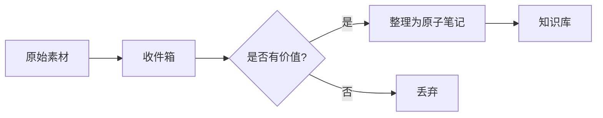
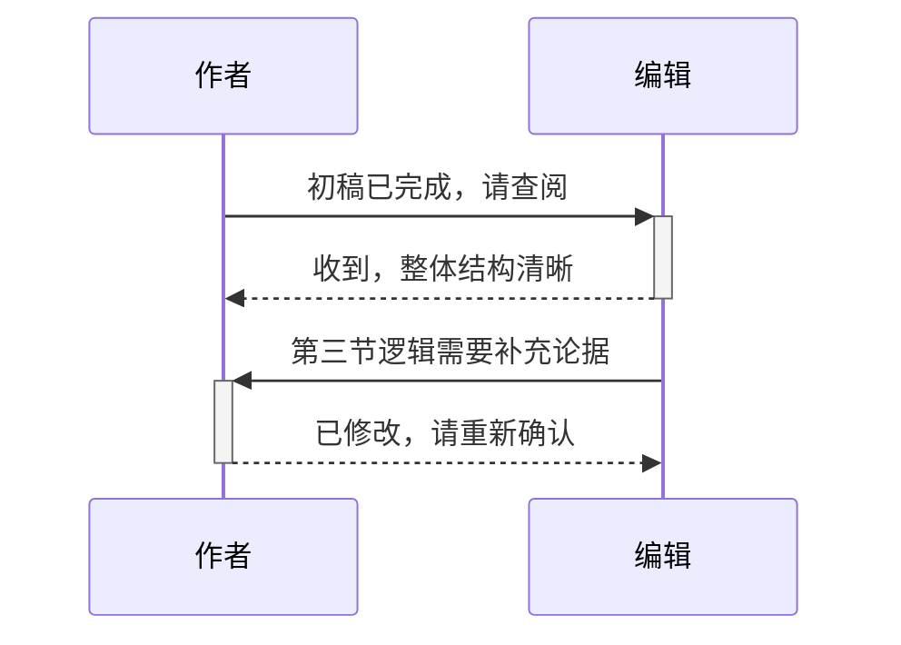
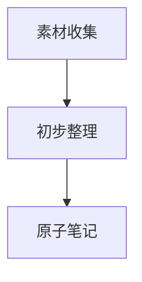
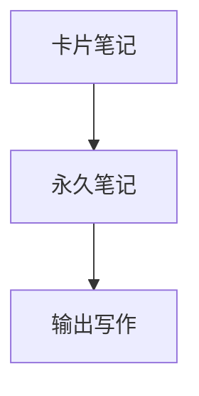
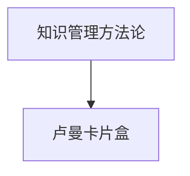

---
tags:
  - Obsidian
  - Markdown
---

# Obsidian Markdown 格式语法完整使用教程

许多人打开 Obsidian 的第一件事，是建好文件夹、装好主题，然后开始写笔记——直到发现渲染效果和预期完全不一样：想要的加粗没有出现，链接变成了普通文字，换行不生效，列表层级混乱。这些困惑几乎都指向同一个根源：对 Markdown 语法的规则还不够熟悉。

Obsidian 使用的是以 CommonMark 规范为基础、叠加 GitHub Flavored Markdown（GFM）的扩展语法，再加上若干 Obsidian 自己的独有扩展——标注（Callouts）、Wiki 链接、嵌入语法等。掌握这套语法体系，既是用好 Obsidian 的前提，也是让各类社区插件（Dataview、Templater、Tasks 等）真正发挥价值的基础。

本文以 Obsidian 的格式语法为主线，覆盖段落、标题、文字格式、链接、图片、表格、引用块、标注、列表、代码块、图表（Mermaid）、数学公式（MathJax）、脚注、注释、转义等核心语法点，并在关键位置补充 Obsidian 特有的行为说明和实用建议。

---

## 目录

1. [段落与换行](Obsidian%20Markdown%20格式语法完整使用教程.md#1.%20段落与换行)
2. [标题](Obsidian%20Markdown%20格式语法完整使用教程.md#2.%20标题)
3. [文字格式：加粗、斜体与高亮](Obsidian%20Markdown%20格式语法完整使用教程.md#3.%20文字格式：加粗、斜体与高亮)
4. [链接：内部链接与外部链接](Obsidian%20Markdown%20格式语法完整使用教程.md#4.%20链接：内部链接与外部链接)
5. [外部图片](Obsidian%20Markdown%20格式语法完整使用教程.md#5.%20外部图片)
6. [表格](Obsidian%20Markdown%20格式语法完整使用教程.md#6.%20表格)
7. [引用块](Obsidian%20Markdown%20格式语法完整使用教程.md#7.%20引用块)
8. [标注（Callouts）](Obsidian%20Markdown%20格式语法完整使用教程.md#8.%20标注（Callouts）)
9. [列表：无序、有序、任务与嵌套](Obsidian%20Markdown%20格式语法完整使用教程.md#9.%20列表：无序、有序、任务与嵌套)
10. [分隔线](Obsidian%20Markdown%20格式语法完整使用教程.md#10.%20分隔线)
11. [代码：行内代码与代码块](Obsidian%20Markdown%20格式语法完整使用教程.md#11.%20代码：行内代码与代码块)
12. [图表（Mermaid）](Obsidian%20Markdown%20格式语法完整使用教程.md#12.%20图表（Mermaid）)
13. [数学公式（MathJax）](Obsidian%20Markdown%20格式语法完整使用教程.md#13.%20数学公式（MathJax）)
14. [脚注](Obsidian%20Markdown%20格式语法完整使用教程.md#14.%20脚注)
15. [注释](Obsidian%20Markdown%20格式语法完整使用教程.md#15.%20注释)
16. [转义 Markdown 语法](Obsidian%20Markdown%20格式语法完整使用教程.md#16.%20转义%20Markdown%20语法)
17. [常见问题与排查](Obsidian%20Markdown%20格式语法完整使用教程.md#17.%20常见问题与排查)
18. [进阶技巧与使用建议](Obsidian%20Markdown%20格式语法完整使用教程.md#18.%20进阶技巧与使用建议)

---

## 1. 段落与换行

### 1.1 段落的基本逻辑

在 Markdown 中，段落是由**空行**来分隔的。这是 Markdown 最基础、也最容易被初学者忽视的规则。只要两段文字之间有一个空行，它们就会被渲染为两个独立的段落；如果没有空行，无论你在编辑器里按了多少次 `Enter`，渲染后都只会显示在同一个段落里。

```
知识管理从建立习惯开始。

一个好的笔记系统，不仅能帮你记录想法，更能在需要时快速检索和回顾。
```

渲染后，两段文字之间会有自然的段落间距。文本行之间的空行会创建独立的段落，这是 Markdown 的默认行为。

> 💡 **说明（多个空格与空行的折叠行为）**
> 段落内和段落之间的多个相邻空格，在阅读视图或 Obsidian Publish 网站上显示时会被自动折叠为单个空格。类似地，在两段之间打了多个空行，渲染后也只会显示为一个段落分隔，多余的空行不会带来额外的视觉间距。
>
> 如果你确实需要在渲染后保留多个连续空格，或者需要强制插入额外的垂直间距，可以使用 HTML 标签实现：`&nbsp;` 是不间断空格（Non-Breaking Space），`<br>` 则是强制换行标签。这两种方式在阅读视图中均有效。

### 1.2 换行的三种情形

换行是段落里最容易引起困惑的地方。在 Obsidian 的默认设置下，按一次 `Enter` 会在编辑器里开始新的一行，但在渲染后，这被视为同一段落的**延续**，两行文字会合并显示在同一行。这遵循了标准的 Markdown 行为——单次回车被当作软换行，不会产生视觉上的断行效果。

要在段落**内**插入真正的换行（而不是开始新段落），有两种方式可以选择：

- 在按 `Enter` 之前，在行末添加**两个空格**，然后回车
- 使用快捷键 `Shift+Enter` 直接插入换行

这两种方式都不会开始新段落，只是在同一段落内强制断开到下一行。

> ❓ **为什么多次按 Enter 不会在阅读视图中产生更多换行？**
> 在 Markdown 中，单个 `Enter` 会被忽略，多个连续的 `Enter` 只会产生一个新段落。这种行为符合 Markdown 的软换行规则，即额外的空行不会生成额外的换行或段落——它们会被折叠为单个段落分隔。这是 Markdown 处理文本的默认方式，确保段落自然流动而不会出现意外的断行。

### 1.3 严格换行模式

Obsidian 提供了一个名为**严格换行**（Strict Line Breaks）的设置，开启后 Obsidian 会遵循标准 Markdown 规范来处理换行，行为会与默认模式有所不同。

启用方式如下：

1. 打开**设置**。
2. 转到**编辑器**选项卡。
3. 找到并启用**严格换行**。

开启**严格换行**后，换行行为依据行与行之间的分隔方式，分为三种情形：

**单次回车且无尾随空格**：单个 `Enter` 且没有尾随空格时，渲染后两行会合并显示为一行。

```
整理笔记的第一步是分类
第二步是建立索引
```

渲染为：整理笔记的第一步是分类 第二步是建立索引

**单次回车且有两个或更多尾随空格**：如果在按 `Enter` 之前，在第一行末尾添加了两个或更多空格，则两行仍属于同一段落，但会通过换行符（HTML `<br>` 元素）分隔，在视觉上产生断行效果，而不开始新段落。

```
整理笔记的第一步是分类  
第二步是建立索引
```

渲染为：

整理笔记的第一步是分类  
第二步是建立索引

**双次回车（无论是否有尾随空格）**：按两次（或更多次）`Enter` 会将行分为两个独立的段落（HTML `<p>` 元素），无论第一行末尾是否有空格。

```
输入是知识积累的起点。

输出是知识内化的终点。
```

渲染为：

输入是知识积累的起点。

输出是知识内化的终点。

> 💡 **说明**
> 如果你的 Markdown 笔记需要与其他编辑器（如 Typora、VS Code 的 Markdown 插件等）保持兼容，建议开启严格换行模式，以避免因软换行行为差异而导致的显示不一致。对于仅在 Obsidian 内使用的笔记，保持默认关闭状态即可，日常写作更加自然流畅。

---

## 2. 标题

标题是笔记结构的骨架，也是大纲视图和标题跳转功能的依据。在 Markdown 中，标题通过在文字前添加 `#` 符号来创建，`#` 的数量决定标题的层级，最多支持六级标题。

```md
# 这是一级标题
## 这是二级标题
### 这是三级标题
#### 这是四级标题
##### 这是五级标题
###### 这是六级标题
```

`#` 符号与标题文字之间需要有一个空格，否则 Obsidian 不会将其识别为标题。

标题层级的选择建议遵循文档逻辑：`#` 通常只作为文章总标题使用，正文内容的章节从 `##` 开始，小节用 `###`，子小节用 `####`。避免跳级使用标题（如从 `##` 直接跳到 `####`），这会影响大纲视图的可读性，也会让结构显得混乱。

> 💡 **说明**
> Obsidian 的**大纲**（Outline）核心插件会根据笔记中的标题自动生成文档大纲，显示在右侧边栏中，方便在长篇笔记中快速跳转。合理使用标题层级，是让大纲功能真正发挥价值的前提。此外，Obsidian 的内部链接支持直接链接到笔记内的特定标题，如 `[[卡片笔记写作法#第二章]]`，这也要求标题层级清晰一致。

---

## 3. 文字格式：加粗、斜体与高亮

Obsidian 支持多种行内文字格式，包括加粗、斜体、删除线和高亮，均可通过特定的符号包裹文字实现。这些格式也可以通过编辑相关的快捷键来应用，不必每次都手动输入符号。

| 样式      | 语法                    | 示例                  | 输出                    |
| ------- | --------------------- | ------------------- | --------------------- |
| 加粗      | `** **` 或 `__ __`     | `**加粗文本**`          | **加粗文本**              |
| 斜体      | `* *` 或 `_ _`         | `*斜体文本*`            | *斜体文本*                |
| 删除线     | `~~ ~~`               | `~~删除线文本~~`         | ~~删除线文本~~             |
| 高亮      | `== ==`               | `==高亮文本==`          | ==高亮文本==              |
| 加粗和嵌套斜体 | `** **` 和 `_ _`       | `**加粗文本和_嵌套斜体_文本**` | **加粗文本和 * 嵌套斜体 * 文本** |
| 加粗和斜体   | `*** ***` 或 `___ ___` | `***加粗和斜体文本***`     | ***加粗和斜体文本***         |

几点使用细节值得注意：

加粗和斜体的 `*` 与 `_` 写法在多数情况下效果相同，但在中文混排环境下，`_` 下划线风格有时会出现识别问题——尤其是当文字紧邻中文字符时，Obsidian 可能无法正确解析。**在中文笔记中，建议优先使用 `*` 风格**（即 `**加粗**` 和 `*斜体*`），以避免潜在的渲染问题。这也是 CommonMark 规范和众多 Markdown 教程中的一致推荐。

高亮 `== ==` 是 Obsidian 特有的扩展语法，不在标准 CommonMark 规范内。在其他 Markdown 编辑器中，此语法可能无法正常渲染，使用时需留意跨平台兼容性。

### 3.1 转义显示格式符号

有时你需要在正文中直接显示 `*`、`_` 等符号本身，而不希望它们触发格式效果。此时可以在符号前添加反斜杠 `\` 来转义：

```
价格为 \*\*88 元\*\*，此处星号仅作装饰，非加粗语法。
```

渲染后显示为：价格为 \*\*88 元\*\*，此处星号仅作装饰，非加粗语法。

```
\*从零开始学 Obsidian\*，这行文字不会被斜体化。
```

渲染后显示为：\* 从零开始学 Obsidian\*，这行文字不会被斜体化。

> 💡 **说明**
> 转义字符 `\` 只对紧跟在它后面的那一个特殊字符生效，不会影响其他字符。完整的转义语法规则详见本文第十六节。

### 3.2 中文混排下的内联标记规范

在上方的语法表格中，`** **` 与 `__ __`、`* *` 与 `_ _` 被列为等价写法，在纯英文环境中它们确实等价，但在中文写作中，两种风格的实际可靠性存在根本性差异，不能随意互换。

**为什么中文笔记建议弃用下划线**

CommonMark 规范对下划线标记（`_`、`__`）有一条特殊的「词内」（intra-word）限制：当标记左右两侧都是字母或数字时，下划线不能激活格式。由于汉字之间没有空格，中文整体上被视为一个连续的「词」，这导致 `_` 和 `__` 在中文行内位置几乎完全失效——这不是偶发问题，而是规范的必然结果：

```markdown
❌ 字体_斜体_字体     → 不渲染（词内下划线，规范强制忽略）
✅ 字体*斜体*字体     → 正常渲染（星号标记没有词内限制）
```

> ⚠️ **注意（弃用下划线）**
> 在所有包含中文的 Markdown 写作中，建议弃用 `_`（斜体）和 `__`（加粗），只使用 `*` 和 `**`。这条规则没有例外，一次性消除下划线的全部失效问题。

**Unicode 标点边界失效：影响所有内联标记**

除了下划线的词内限制，还有一个更隐蔽的问题——它同样影响星号标记，并且波及 `**`、`*`、`~~`、`==` 所有格式符号。

CommonMark 规范的「侧翼判定规则」（Flanking Delimiter Rule）规定：强调标记的直接内侧字符不能是 Unicode 标点类字符（涵盖 Pc、Pd、Pe、Pf、Pi、Po、Ps 七大类别），否则该标记无法成功「关闭」或「开启」，整个格式对失效。中文写作中常见的高危字符包括：

- 全角括号：`（）「」【】《》〔〕`
- 全角句号、逗号、顿号、问叹号：`。，、？！`
- 全角引号与破折号：`""''——`
- 省略号：`……`

英文写作中，句末标点后通常跟着空格，空格满足外侧条件，即使内侧是标点也能成功闭合。但中文书写无空格，`**内容。**后文` 中关闭标记外侧紧跟汉字、内侧又是句号，双重条件触发失效。这是 CJK 书写结构的必然结果，而非可以偶然规避的边缘情况。

> ⚠️ **注意**
> 这不是 Obsidian 的 Bug，而是 CommonMark 规范对无空格书写系统的结构性局限，同样影响 GitHub、VS Code、Typora 等所有基于 CommonMark 的渲染器。截至 2026 年，官方规范尚未合并针对 CJK 语言的修复补丁。

**边界安全写作规则**

以下规则适用于所有内联标记（`**`、`*`、`~~`、`==`），核心原则统一：**标记的直接内侧字符必须是汉字、字母或数字，不得是任何标点符号。**

**规则一：边界字符检查**

每写下一个强调结构，只检查一件事：标记左右内侧各紧邻的一个字符是什么。

- 若为文字（汉字、字母、数字）→ 安全，无需处理
- 若为任何标点（全角或半角，括号、句号、逗号、引号、破折号等）→ 存在失效风险，须处理

**规则二：标点外移**

当标点出现在强调范围的首尾边界时，将其移至标记范围之外：

```
❌ **出站链接（Outgoing Links）**后文    → 括号紧贴内侧，失效
✅ **出站链接**（**Outgoing Links**）后文

❌ **处理完毕。**下一步                  → 句号紧贴内侧，失效
✅ **处理完毕**。下一步

❌ ~~已废弃的方法。~~继续               → 删除线同样受影响
✅ ~~已废弃的方法~~。继续

❌ ==重要提示！==请注意                 → 高亮同样受影响
✅ ==重要提示==！请注意

❌ **（注意）请务必阅读**               → 开头括号紧贴内侧，失效
✅ （**注意**）**请务必阅读**
```

**规则三：中间标点无需处理**

当标点出现在强调范围的中间位置（两端均为文字），侧翼判定看的是标记直接内侧的字符，中间的标点不影响边界判定，可以整体包裹：

```
✅ **中英混排（Mixed）文字**         ← 前接「中」，后接「字」，安全
✅ **设置 → 链接 → 选项**           ← 箭头在中间，两端是文字，安全
✅ ~~某功能（v1.0 已移除）的说明~~  ← 同理，安全
✅ ==概念（Concept）的定义==        ← 同理，安全
```

**规则四：Wiki 链接边界处理**

Wiki 链接的方括号 `[[` 和 `]]` 在规范中属于标点类字符（Ps / Pe 类别），与普通括号遵循完全相同的侧翼规则：

```
❌ **[[笔记名]]**后文     → ]] 是标点，外侧是汉字，失效
✅ **[[笔记名]]** 后文    → 外侧是空格，成功（注意后面须有空格）
✅ [[**笔记名**]]         → 将加粗移入链接内（Obsidian 支持此写法）
✅ **笔记[[笔记名]]内容** → 两端是文字，链接在中间，安全
```

实践建议：避免用强调标记将整个 Wiki 链接包裹；改为在链接内部加粗，或调整句式使链接不出现在强调边界。

**规则五：中英混排的半角标点边界**

中英混排时，若强调块以半角标点结尾且外侧紧跟汉字（无空格分隔），同样会失效：

```
❌ **see config.**配置方法    → 半角句号在内侧，外侧紧跟汉字
✅ **see config**. 配置方法

❌ **Result:**结果说明
✅ **Result**：结果说明
```

**快速检查流程**

写下任意内联标记后，按以下步骤检查：

1. 使用了 `_` 或 `__` 且内容包含中文 → 直接替换为 `*` 或 `**`，无需后续步骤
2. 检查标记直接内侧左右各一个字符：是文字则安全；是标点则将标点移至标记范围之外
3. 含有 Wiki 链接且位于强调边界 → 改为 `[[**笔记名**]]` 或拆分句式

**规则速查表**

| 场景 | 示例结构 | 稳定性 | 处理策略 |
| :--- | :--- | :---: | :--- |
| 下划线强调（含中文） | `_文字_` / `__文字__` | 💀 极不稳定 | 弃用，改用 `*` / `**` |
| 纯文字强调 | `**文字**` | 🟢 安全 | 直接使用 |
| 标点在中间 | `**文字（符号）文字**` | 🟢 安全 | 整体包裹 |
| 操作路径（文字结尾） | `**设置 → 链接**` | 🟢 安全 | 直接使用 |
| 标点在结尾 | `**文字（符号）**` | 🔴 失效 | 标点外移 |
| 标点在开头 | `**（符号）文字**` | 🔴 失效 | 标点外移 |
| 句号逗号在结尾 | `**文字。**` / `~~文字，~~` | 🔴 失效 | 标点外移 |
| Wiki 链接被包裹 | `**[[笔记名]]**后文` | 🔴 失效 | 拆分或调整句式 |
| 中英混排无空格 | `**word.**汉字` | 🔴 失效 | 标点外移或加空格 |

---

## 4. 链接：内部链接与外部链接

链接是 Obsidian 笔记网络的基础，分为内部链接（指向库内其他笔记）和外部链接（指向网页 URL）两类，语法上有明显区别。

### 4.1 内部链接

Obsidian 支持两种内部链接格式，可以根据个人习惯或兼容性需求选择：

**Wiki 链接格式**（Obsidian 默认推荐）：

```
[[费曼学习法]]
```

**Markdown 标准格式**：

```
[费曼学习法](费曼学习法.md)
```

两种写法在 Obsidian 中均可正常创建笔记间的双向链接关系，并在图谱视图中显示为连接节点。Wiki 链接格式书写更简便，是 Obsidian 社区的主流用法；Markdown 标准格式则更具跨平台兼容性，如果你的笔记需要发布到 GitHub 或其他平台，标准格式的可移植性更好。

> 💡 **说明**
> 内部链接还支持更精细的定位方式：
> - 链接到特定标题：`[[费曼学习法#第二步：用自己的语言复述]]`
> - 链接到特定段落块：`[[费曼学习法#^abc123]]`（块 ID 在 Obsidian 中自动生成或手动指定）
> - 同笔记内的章节跳转：`[[#当前笔记内的标题]]`
> 
> 根据 Obsidian 社区论坛的讨论，Wiki 链接在反向链接（Backlinks）面板中的显示和追踪效果通常比标准 Markdown 链接更为稳定，因此库内笔记之间的链接推荐优先使用 Wiki 格式。

### 4.2 外部链接

外部链接使用标准的 Markdown 链接语法：方括号 `[ ]` 包裹链接文本，圆括号 `( )` 包裹 URL。

```
[Obsidian 官方网站](https://obsidian.md)
```

渲染后，链接文字会显示为可点击的超链接。

你也可以通过链接到 Obsidian URI 来创建指向其他仓库中文件的外部链接：

```
[我的周报模板](obsidian://open?vault=工作库&file=模板/周报.md)
```

### 4.3 处理 URL 中的空格

如果你的 URL 包含空格（例如 Obsidian URI 中的文件路径），有两种方式可以正确处理：

**方式一：将空格替换为 `%20`**

```
[本月读书计划](obsidian://open?vault=知识库&file=阅读/2025%20年读书计划.md)
```

**方式二：用尖括号 `< >` 包裹整个 URL**

```
[本月读书计划](<obsidian://open?vault=知识库&file=阅读/2025 年读书计划.md>)
```

两种方式效果相同。方式二书写时更直观，在 URL 较长且包含多个空格时尤为方便。

---

## 5. 外部图片

Obsidian 支持通过 URL 在笔记中嵌入外部图片，语法是在外部链接的基础上，在最前面加一个 `!` 感叹号：

```

```

方括号内是图片的替代文字（Alt Text），当图片无法加载时会显示此文字；圆括号内是图片的 URL。

### 5.1 控制图片尺寸

可以通过在链接目标中添加 `|宽度x高度` 来指定图片的显示尺寸，其中宽度和高度的单位为像素：

```

```

如果只指定宽度而不指定高度，图片会按原始宽高比等比缩放：

```

```

这种写法比直接使用 HTML `` 标签更简洁，也是 Obsidian 中控制图片大小的推荐方式。

> 💡 **说明**
> 以上语法适用于外部 URL 图片。如果你想嵌入的是保存在库内的本地图片，可以使用与内部链接类似的嵌入语法：`![[图片文件名.png]]`，同样支持通过 `|宽度` 参数控制显示大小，例如 `![[知识管理流程图.png|480]]`。

---

## 6. 表格

表格是 Obsidian 中整理对比信息的常用工具，其语法基于 GFM（GitHub Flavored Markdown）规范：用竖线 `|` 分隔列，用至少三个连字符 `-` 组成分隔行来区分表头和表体。

### 6.1 基本表格语法

下面是一个记录笔记库文件夹结构的表格示例：

```
| 文件夹名称 | 存放内容 | 更新频率 |
| --- | --- | --- |
| 01-收件箱 | 未处理的原始素材 | 每日 |
| 02-笔记 | 加工后的原子笔记 | 每周 |
| 03-项目 | 进行中的项目文档 | 按需 |
| 04-归档 | 已完成或暂停的内容 | 较少 |
```

渲染后显示为整齐的表格。表格前后必须有空行，否则 Obsidian 可能无法正确识别表格语法。

需要注意的是，**表格两侧的竖线是可选的**。如果你觉得外层竖线让源码显得拥挤，可以省略，效果完全相同：

```
笔记类型 | 核心用途 | 适合存放内容
--- | --- | ---
闪念笔记 | 快速捕捉灵感 | 零散想法与待处理信息
永久笔记 | 沉淀知识结论 | 经过加工的原子化观点
项目笔记 | 推进具体任务 | 与某个目标相关的素材集合
```

> ⚠️ **注意**
> 表格的分隔行（第二行）中，每列至少需要三个连字符 `---`，数量不需要和内容等宽对齐，Obsidian 在渲染时会自动处理列宽。但若希望在源码模式下保持整洁，可以手动将各列宽度对齐——这不影响渲染结果，仅影响源码可读性。

### 6.2 列对齐

通过在分隔行中为连字符添加冒号，可以控制每列的对齐方式：

- `:---` 左对齐（默认）
- `:---:` 居中对齐
- `---:` 右对齐

```
| 工具名称 | 主要用途 | 月费用 |
| :--- | :---: | ---: |
| Obsidian | 本地笔记管理 | 免费 |
| Dataview | 笔记数据查询 | 免费 |
| Obsidian Sync | 官方多端同步 | $5 |
| Obsidian Publish | 发布笔记网站 | $8 |
```

渲染后，「工具名称」列左对齐，「主要用途」列居中，「月费用」列右对齐，价格数字靠右排列更为整洁。

### 6.3 表格内的格式化

表格单元格内可以使用大部分行内 Markdown 格式，包括加粗、斜体、行内代码和链接：

```
| 语法类型 | 示例 | 说明 |
| --- | --- | --- |
| 加粗 | **重点** | 标记核心概念 |
| 行内代码 | `print()` | 标注函数名或命令 |
| 内部链接 | [[费曼学习法]] | 链接到相关笔记 |
```

> ⚠️ **注意**
> 如果需要在表格单元格内使用竖线 `|` 字符本身（例如在链接别名中，或者需要调整图片大小时），需要用反斜杠转义：`\|`。例如在表格中嵌入带别名的内部链接，需写作 `[[费曼学习法\|Feynman Technique]]`；调整图片大小需写作 `![[示意图.png\|200]]`。

### 6.4 表格的实用建议

手动编写和维护较大的 Markdown 表格是一件相当繁琐的事，列数一多便很难保持源码对齐，增改内容时也容易引入格式错误。社区插件 **Advanced Tables** 是解决这一问题的主流方案：安装后，只需输入第一行表头，按 `Tab` 键触发自动补全，之后通过 `Tab` / `Shift+Tab` 在单元格间移动，`Enter` 完成输入并自动换行，格式化完全自动处理。

> ✅ **推荐做法**
> 对于经常需要编辑表格的用户，Advanced Tables 是强烈推荐的社区插件，其下载量长期位居社区插件前列。进入「设置 → 社区插件 → 浏览」，搜索「Advanced Tables」即可安装。

---

## 7. 引用块

在文本前添加 `>` 符号，可以将该文字渲染为引用格式（Blockquote）——通常在视觉上表现为左侧带有竖线、文字略有缩进的样式。

```
> 学而不思则罔，思而不学则殆。
>
> ——《论语·为政》
```

渲染效果：

> 学而不思则罔，思而不学则殆。
>
> ——《论语·为政》

引用块可以嵌套使用，在 `>` 后再加一个 `>` 即可创建二级引用，常用于展示问答或层层递进的论述：

```
> 什么是费曼学习法？
>> 找到一个概念，用最简单的语言向一个不懂的人解释它。
>> 凡是说不清楚的，说明自己还没真正理解。
```

引用块内部也可以包含其他 Markdown 格式，如列表、代码、加粗等，使其不仅限于纯文本引用。

> 💡 **说明**
> Obsidian 的**标注（Callouts）**功能是对引用块的扩展——在引用块的第一行添加 `[!类型]` 关键词，可以将普通引用转变为具有图标和颜色样式的提示块。标注是 Obsidian 独有的功能，是组织笔记中的提示、警告和附加说明的实用工具，详见下一节。

---

## 8. 标注（Callouts）

标注是 Obsidian 在引用块语法基础上的独有扩展，于 2022 年中正式引入，目前已成为 Obsidian 笔记中使用最广泛的视觉组织工具之一。标注的本质是一个带有类型标记的引用块，Obsidian 会将其渲染为带有图标、颜色和可选折叠功能的样式盒子。

### 8.1 基本语法

在引用块的**第一行**添加 `[!类型]`，即可将普通引用块转换为标注：

```
> [!info]
> 这是一个信息类标注，默认标题为「Info」。
```

也可以在类型标识符后紧跟自定义标题，覆盖默认标题：

```
> [!tip] 小技巧：善用快捷键
> 按 Ctrl/Cmd+P 打开命令面板，输入关键词即可快速执行任何操作，无需记忆大量快捷键。
```

标注的正文部分（第二行起）可以包含所有标准 Markdown 格式，包括列表、代码块、加粗、内部链接等。

### 8.2 支持的类型

Obsidian 目前支持 12 种以上的内置标注类型，每种类型有其默认的图标和配色方案（具体颜色因主题不同而有所差异）：

| 类型关键词 | 默认标题 | 适用场景 |
| :--- | :--- | :--- |
| `note` | Note | 普通补充说明 |
| `abstract` / `summary` / `tldr` | Abstract | 摘要或总结 |
| `info` | Info | 中性信息说明 |
| `todo` | To-Do | 待办事项 |
| `tip` / `hint` / `important` | Tip | 实用建议 |
| `success` / `check` / `done` | Success | 成功或完成状态 |
| `question` / `faq` / `help` | Question | 问题或常见疑问 |
| `warning` / `caution` / `attention` | Warning | 需要注意的事项 |
| `failure` / `fail` / `missing` | Failure | 错误或失败情形 |
| `danger` / `error` | Danger | 危险或严重错误 |
| `bug` | Bug | 已知问题记录 |
| `example` | Example | 示例内容 |
| `quote` / `cite` | Quote | 引用与出处 |

同一类型支持多个别名，例如 `[!tip]`、`[!hint]`、`[!important]` 渲染效果完全一致，可以选择最符合语义的关键词使用。

### 8.3 可折叠标注

在类型标识符后面紧跟 `+` 或 `-`，可以将标注变为可折叠的手风琴样式：`+` 表示默认展开，`-` 表示默认折叠。在阅读视图和实时预览模式下，点击标注标题栏即可展开或收起内容。

默认展开的可折叠标注（点击可收起）：

```
> [!question]+ 什么是双链笔记？
> 双链笔记指的是笔记之间可以相互引用，形成双向连接。
> 在 Obsidian 中，使用 `[[笔记名称]]` 即可创建一条双向链接，
> 被链接的笔记会在反向链接面板中显示所有指向它的来源笔记。
```

默认折叠的标注（点击可展开），适合存放补充信息或答案：

```
> [!example]- 费曼学习法的四个步骤
> 1. 选择一个你想学习的概念
> 2. 用简单语言向"外行"解释它
> 3. 找出你无法解释清楚的地方，回去重新学习
> 4. 精简语言，去掉不必要的专业术语
```

### 8.4 嵌套标注

标注可以嵌套，在内层标注的每行前多加一个 `>` 即可：

```
> [!warning] 同步前请确认
> 在触发同步之前，请先检查以下事项：
>> [!tip] 建议先备份
>> 首次同步前建议将整个库复制一份作为备份，
>> 以防万一出现意外冲突导致数据丢失。
```

> ⚠️ **注意**
> 标注（Callouts）是 Obsidian 的专有扩展语法，不属于 CommonMark 或 GFM 标准。将含有标注的笔记导出或发布到 GitHub Pages、Notion 等平台时，标注会退化显示为普通引用块。如果笔记需要跨平台发布，请谨慎使用标注或在发布前进行格式转换。

---

## 9. 列表：无序、有序、任务与嵌套

Obsidian 支持四种列表类型，各有其适用的场景。

### 9.1 无序列表

在文本前添加 `-`、`*` 或 `+`，后跟一个空格，即可创建无序列表项：

```
- 《卡片笔记写作法》—— 申克·阿伦斯
- 《深度工作》—— 卡尔·纽波特
- 《如何阅读一本书》—— 莫提默·艾德勒
```

渲染效果：

- 《卡片笔记写作法》—— 申克·阿伦斯
- 《深度工作》—— 卡尔·纽波特
- 《如何阅读一本书》—— 莫提默·艾德勒

三种符号效果相同，但建议在同一篇笔记中保持一致，混用不同符号虽然在语法上允许，但会降低源码的可读性。

### 9.2 有序列表

有序列表每行以数字开头，后跟 `.` 或 `)` 符号：

```
1. 确定笔记库的基本文件夹结构
2. 安装 Templater、Dataview 等核心插件
3. 设置每日笔记和周期性复盘模板
```

或者：

```
1) 确定笔记库的基本文件夹结构
2) 安装 Templater、Dataview 等核心插件
3) 设置每日笔记和周期性复盘模板
```

两种写法均可，渲染后均显示为编号列表。

值得一提的是，有序列表中数字的实际值对 Markdown 渲染器来说通常并不重要——`1. 1. 1.` 和 `1. 2. 3.` 在渲染后往往显示相同的编号序列。不过为了源码的可读性，建议还是按正确顺序书写数字。

你可以使用 `Shift+Enter` 在有序列表中插入换行而不改变编号，这在需要在某个列表项内书写多行说明时很有用：

```
1. 输入阶段：收集原始素材
   
2. 处理阶段：整理为原子笔记
3. 输出阶段：写作与分享
   
4. 复盘阶段：定期回顾与更新
5. 归档阶段：完成后妥善存档
6. 清理阶段：删除无效内容
```

### 9.3 任务列表

任务列表是 Obsidian 中使用频率极高的功能，常用于待办事项、阅读清单等场景。每个任务项以连字符、空格和 `[ ]` 开头：

```
- [x] 整理本月阅读笔记
- [ ] 完成《卡片笔记写作法》的读书摘要
- [ ] 更新项目进度跟踪表
```

渲染效果：

- [x] 整理本月阅读笔记
- [ ] 完成《卡片笔记写作法》的读书摘要
- [ ] 更新项目进度跟踪表

在阅读视图中，可以直接点击复选框来切换任务的完成状态，点击后编辑器中的 `[ ]` 会自动变为 `[x]`。

> 💡 **说明**
> Obsidian 支持在方括号内使用任意字符来标记任务状态，不局限于 `x`。例如：
>
> ```
> - [x] 完成初稿
> - [/] 进行中的修改
> - [-] 已取消的章节
> - [?] 待确认的事项
> ```
>
> 不同字符的视觉样式取决于你所使用的主题。部分主题（如 Minimal、AnuPpuccin 等）针对不同标记字符提供了丰富的颜色和图标样式，可以实现优先级标注、进行中、已取消等多种状态的可视化区分。此外，社区插件 **Tasks** 也支持对任务状态字符进行自定义和查询。

### 9.4 嵌套列表

你可以将任何类型的列表——有序、无序或任务列表——嵌套在任何其他类型的列表下，通过缩进来建立层级关系。嵌套结构中可以自由混合不同类型的列表：

```
1. 输入阶段
   - 阅读书籍与文章
   - 浏览 RSS 订阅源
2. 处理阶段
   - 摘录关键观点
   - 撰写原子笔记
```

渲染效果：

1. 输入阶段
	- 阅读书籍与文章
	- 浏览 RSS 订阅源
2. 处理阶段
	- 摘录关键观点
	- 撰写原子笔记

任务列表同样支持嵌套，常用于分解带有子步骤的任务：

```
- [ ] 完成知识管理系统搭建
    - [x] 设计文件夹结构
    - [ ] 配置 Templater 模板
- [ ] 整理存量笔记
    - [ ] 处理收件箱中的素材
```

渲染效果：

- [ ] 完成知识管理系统搭建
    - [x] 设计文件夹结构
    - [ ] 配置 Templater 模板
- [ ] 整理存量笔记
    - [ ] 处理收件箱中的素材

> ✅ **推荐做法**
> 在编辑器中，使用 `Tab` 键可以将选中的列表项向右缩进一级（变为子列表项），使用 `Shift+Tab` 则向左减少一级缩进。这比手动打空格要方便得多，也能确保缩进量的一致性。

---

## 10. 分隔线

水平分隔线用于在视觉上划分笔记的不同区块。在单独一行中使用三个或更多的星号 `***`、连字符 `---` 或下划线 `___`，即可创建一条水平线。符号之间也可以添加空格：

```
***
****
* * *
---
----
- - -
___
____
_ _ _
```

以上写法均会渲染为相同外观的水平分隔线。在实际使用中，`---` 是最常见的写法，也最不容易与其他语法产生混淆。

> ⚠️ **注意**
> `---` 如果紧跟在一行文字下方，在某些 Markdown 解析器中会被解释为 Setext 风格的二级标题，而非分隔线。在 Obsidian 中，单独占一行的 `---` 始终被解析为分隔线，不存在此歧义。但如果你的笔记需要在其他平台渲染，可以通过在 `---` 之前保留一个空行来避免潜在的解析差异。

---

## 11. 代码：行内代码与代码块

对于需要在笔记中记录代码、命令或技术术语的场景，Obsidian 提供了行内代码和独立代码块两种格式。

### 11.1 行内代码

用单个反引号（`` ` ``）包裹文字，可以在段落中插入行内代码格式。行内代码通常以等宽字体和略微突出的背景色显示，适合在正文中标注命令、函数名、文件路径等技术内容：

```
在 Python 中，使用 `print()` 函数可以向控制台输出内容。
```

渲染效果：在 Python 中，使用 `print()` 函数可以向控制台输出内容。

如果行内代码本身需要包含反引号，可以用双反引号包围整个代码片段：

```
Shell 中的命令替换语法为 ``$(command)``，例如 ``$(date)`` 会返回当前系统时间。
```

渲染效果：Shell 中的命令替换语法为 ``$(command)``，例如 ``$(date)`` 会返回当前系统时间。

### 11.2 代码块

要将多行代码格式化为独立的代码块，可以用三个或更多反引号（` ``` `）或三个或更多波浪号（`~~~`）将代码块前后包围起来：

````
```
ls -la ~/Documents/vault
cd ~/Documents/vault/01-收件箱
```
````

或者：

```
~~~
ls -la ~/Documents/vault
cd ~/Documents/vault/01-收件箱
~~~
```

也可以使用 `Tab` 或 4 个空格缩进文本来创建代码块（这是较为传统的 Markdown 写法，但在 Obsidian 中仍然有效）：

```
    ls -la ~/Documents/vault
```

### 11.3 语法高亮

在代码块起始行的反引号后面，紧接着写上语言标识符，Obsidian 会自动对该语言进行语法高亮，大幅提升代码的可读性：

````
```python
def word_count(text):
    """统计文本中的单词数量"""
    if not text.strip():
        return 0
    return len(text.strip().split())
```
````

渲染效果：

```python
def word_count(text):
    """统计文本中的单词数量"""
    if not text.strip():
        return 0
    return len(text.strip().split())
```

Obsidian 使用 **Prism** 进行语法高亮，支持的语言种类非常丰富，覆盖 JavaScript、Python、CSS、SQL、Shell、YAML 等绝大多数常用语言。完整的语言列表可以参考 [Prism 官方文档](https://prismjs.com/#supported-languages)。

> ⚠️ **注意**
> 源码模式和实时预览模式**不支持** PrismJS 高亮，可能会以不同方式渲染语法颜色。完整的语法高亮效果只在**阅读视图**中生效。如果你在实时预览模式下看到代码块没有颜色，切换到阅读视图即可看到正常的高亮效果。

值得一提的是，Obsidian 还支持一些特殊的代码块类型。在语言标识符位置填写 `mermaid`，Obsidian 会将代码块内容渲染为 Mermaid 流程图或时序图，无需安装任何插件；填写 `math` 则可渲染 LaTeX 数学公式块。这两种特殊代码块类型分别在第十二节和第十三节中详细介绍：

````

````

### 11.4 嵌套代码块

在编写教程或文档时，有时需要在代码块内展示另一个代码块的写法（例如说明如何创建代码块本身）。这种情况下，外层代码块需要使用比内层**更多**的围栏字符：

`````
````md
以下是 Python 语法高亮代码块的写法：
```python
result = sum(range(1, 101))
print(f"1 到 100 的总和为：{result}")
```
````
`````

也可以混合使用反引号和波浪号。这在处理生成其他代码块的代码时特别有用：

`````
````md
```dataviewjs
dv.table(["笔记名称", "创建日期"],
    dv.pages('"02-笔记"')
    .sort(p => p.file.ctime, 'desc')
    .slice(0, 10)
    .map(p => [p.file.link, p.file.ctime])
)
```
````
`````

关键原则是：外层代码块必须使用**更多的**围栏字符（反引号或波浪号），或使用不同类型的围栏字符（反引号 vs 波浪号），才能与内层的围栏字符区分开来，避免解析混乱。

---

## 12. 图表（Mermaid）

Obsidian 内置了对 [Mermaid](https://mermaid-js.github.io/) 语法的完整支持，无需安装任何插件。只需创建一个语言标识符为 `mermaid` 的代码块，即可在笔记中渲染各类图表和流程图。Mermaid 支持时序图、流程图、甘特图、时间线等多种图表类型，是记录系统架构、梳理流程逻辑、可视化知识关系的利器。

> 💡 **说明**
> Mermaid 官方提供了 [在线编辑器](https://mermaid-js.github.io/mermaid-live-editor)，可以在其中实时预览和调试图表语法。在语法还不熟练时，可以先在线编辑器中调通，再将代码粘贴到 Obsidian 笔记里，避免反复修改。

### 12.1 时序图

时序图（Sequence Diagram）用于描述多个参与者之间随时间推进的交互过程，常用于记录系统流程、工作协作流程或信息传递步骤。

以下示例描述了一篇笔记从草稿到发布的审阅流程：

`````

`````

`->>+` 表示激活目标参与者，`-->>-` 表示目标参与者回复并停用。Mermaid 会自动为各参与者绘制生命线，并按时间顺序排列消息箭头。

### 12.2 流程图

流程图（Flowchart）适合描述有向流程、决策分支或模块之间的依赖关系。`graph TD` 表示从上到下（Top Down）的布局方向，`graph LR` 则表示从左到右（Left Right）。

以下示例展示了一条简化的知识处理路径：

`````

`````

渲染后会显示一个带箭头的有向图，三个节点依次向下连接。你可以在此基础上继续扩展节点和分支，构建更完整的工作流示意图。

### 12.3 在图表中添加内部链接

Mermaid 支持将节点声明为 `internal-link` 类，使其成为可点击的 Obsidian 内部链接，点击后会直接跳转到对应笔记。在图表末尾添加 `class` 声明即可实现：

`````

`````

当图表中节点数量较多时，可以预先将所有节点声明为字母变量，并在节点方括号中填写显示文字，然后统一将所有变量设置为 `internal-link` 类：

`````

`````

这样，每个字母变量对应的节点都会成为内部链接，节点中括号内的显示文字将作为链接文本用于跳转。

> ⚠️ **注意**
> 图表中的内部链接**不会**显示在关系图谱（Graph View）中。如果你的笔记名称包含特殊字符（如 `⨳`、`#`、`*` 等），需要将节点名称放在双引号中，否则 Mermaid 解析可能出错。正确写法有两种：在 `class` 声明中使用 `class "⨳ 特殊字符" internal-link`，或在节点定义时使用 `A["⨳ 特殊字符"]`。

想了解更多 Mermaid 图表类型（甘特图、状态图、饼图、时间线等）和完整语法，可以参阅 [Mermaid 官方文档](https://mermaid.js.org/intro/)。

---

## 13. 数学公式（MathJax）

Obsidian 内置了对 [MathJax](http://docs.mathjax.org/en/latest/basic/mathjax.html) 的支持，可以使用 LaTeX 符号在笔记中渲染精美的数学公式，同样无需安装额外插件。MathJax 是学术写作、数理笔记和技术文档中不可或缺的工具。

### 13.1 块级数学公式

用双美元符号 `$$` 将数学公式包裹起来（独立占行），可以创建居中展示的块级数学公式。以下以复利计算公式为例：

```
$$
A = P \left(1 + \frac{r}{n}\right)^{nt}
$$
```

渲染后，公式会以标准数学排版形式独立显示于页面中央，分数、括号与上标均以专业格式呈现。这种写法适合展示完整的公式推导、方程组或需要突出显示的核心表达式。

### 13.2 行内数学公式

用单个美元符号 `$` 包裹数学表达式，可以在段落中嵌入行内公式，公式会与周围文字保持垂直对齐：

```
根据勾股定理，直角三角形三边之间满足关系 $a^2 + b^2 = c^2$，其中 $c$ 为斜边长度。
```

渲染后，公式会嵌入在文字流中，与段落正文一体显示，不会打断阅读节奏。行内公式适合在正文中引用变量名、简单表达式或公式编号。

> 💡 **说明**
> 想系统学习 LaTeX 数学公式的写法，可以参阅 [MathJax 基础教程与快速参考](https://math.meta.stackexchange.com/questions/5020/mathjax-basic-tutorial-and-quick-reference)，其中涵盖了分数、根号、求和、积分、矩阵等常见数学结构的语法。若需要查看 Obsidian 当前支持的完整 MathJax 扩展包列表，可参考 [TeX/LaTeX 扩展列表](http://docs.mathjax.org/en/latest/input/tex/extensions/index.html)。

> ⚠️ **注意**
> MathJax 数学公式的完整渲染效果仅在**阅读视图**中生效，实时预览模式下的渲染效果可能有所差异。如果你在实时预览模式下发现公式显示异常，切换到阅读视图即可看到正确的渲染结果。

---

## 14. 脚注

脚注用于在不打断正文阅读节奏的情况下，为某段内容提供补充说明或参考来源。Obsidian 支持两种脚注写法。

**标准脚注**：在正文中插入 `[^标识符]`，然后在文档任意位置（通常在文末）定义脚注内容：

```
Markdown 由 John Gruber 于 2004 年发明[^origin]，最初的设计目标是让纯文本尽可能接近最终渲染的格式。

[^origin]: 参见 Gruber 原始介绍文章：https://daringfireball.net/projects/markdown/
[^gfm]: GitHub Flavored Markdown 在此基础上增加了表格、任务列表、删除线等扩展语法。
[^commonmark]: CommonMark 于 2014 年发布，旨在统一各种 Markdown 方言的解析标准。
```

脚注标识符可以是数字，也可以是有意义的文字名称（如 `[^origin]`）。命名脚注在渲染时仍然显示为数字顺序，但在编辑源码时可以通过名称更容易地找到和管理对应的脚注内容。

**行内脚注**：直接在正文中插入脚注内容，适合内容简短、不需要单独管理的场景。注意插入符号 `^` 位于方括号**外面**：

```
卡片笔记法最早由德国社会学家卢曼（Niklas Luhmann）系统化实践。^[卢曼在其学术生涯中积累了超过 9 万张卡片，并据此发表了大量著作。]
```

> ⚠️ **注意**
> 行内脚注仅在**阅读视图**中有效，在实时预览模式中无法正常渲染。如果你主要在实时预览模式下工作，建议使用标准脚注格式以确保一致的显示效果。

Obsidian 的**脚注视图**（Footnotes View）核心插件可以在侧边栏展示当前笔记中的所有脚注列表，便于统一管理和查阅，对脚注较多的笔记尤其实用。

---

## 15. 注释

Markdown 本身没有注释语法，Obsidian 在此基础上扩展了自己的注释格式：用 `%%` 包裹的文字会被识别为注释，**仅在编辑模式中可见**，在阅读视图和导出后均不显示。

注释可以是行内的：

```
这段内容已于 2025 年 5 月更新 %%（原稿过于冗长，已精简约 30%）%%，请以当前版本为准。
```

也可以是跨多行的块注释：

```
%%
待办事项（仅自用）：
- 补充第三章的案例分析
- 核实所有引用文献的出处
- 请同事审阅整体逻辑结构
预计完成时间：2025 年 6 月底
%%
```

注释功能常用于以下几个场景：在笔记中留下只给自己看的提醒和备忘；暂时隐藏某段内容而不删除它（方便日后恢复）；在 Publish 网站上发布笔记时，保留不想对外公开的编辑备注；以及在模板文件中添加使用说明，而不影响模板最终的渲染输出。

> 💡 **说明**
> `%%` 注释语法是 Obsidian 的扩展，不属于标准 Markdown 规范。在 Obsidian 之外的编辑器中，`%%` 包裹的内容可能会被正常显示出来，而非作为注释隐藏。如果你的笔记需要跨平台使用，需要留意这一差异。

---

## 16. 转义 Markdown 语法

Markdown 中有一些具有特殊含义的字符，例如 `*`、`_`、`#`、`` ` `` 等。当你需要在正文中原样显示这些字符，而不希望它们触发格式效果时，可以在字符前面添加反斜杠 `\` 来进行转义。

> 📝 **常见需要转义的字符**
> - 星号：`\*`
> - 下划线：`\_`
> - 井号：`\#`
> - 反引号：`` \` ``
> - 管道符（用于表格）：`\|`
> - 波浪号：`\~`

示例：

```
产品定价为 \*\*998 元\*\*（此处星号为装饰符号，不触发加粗）。
```

渲染为：产品定价为 \*\*998 元\*\*（此处星号为装饰符号，不触发加粗）。

在使用有序列表时，如果你写了 `数字.` 开头的行但不希望它被识别为列表项，可以将反斜杠放在**句点前面**（而非数字前面）来转义：

```
2026\. 这是今年的年份，不是第 2026 个列表项。
```

渲染为：2026\. 这是今年的年份，不是第 2026 个列表项。

> ⚠️ **注意**
> 转义行为依赖于 Obsidian 所使用的 Markdown 解析器，在极少数边缘情况下可能存在转义未生效的情形（例如某些渲染模式下对有序列表前缀的处理）。如果遇到转义不生效的问题，可以考虑改用 HTML 实体（如 `&#42;` 表示 `*`、`&#124;` 表示 `|`）作为替代方案，HTML 实体在 Obsidian 的阅读视图中均可正常渲染。

---

## 17. 常见问题与排查

### 17.1 格式没有渲染，显示原始符号

最常见的原因是符号与文字之间缺少空格，或者使用了全角符号（中文输入法下的 `＊` 和 `**` 是不同的字符）。请检查以下几点：

- `#` 号后面必须有一个英文空格，才能被识别为标题；`#文字` 不是标题，是标签。
- 加粗和斜体的 `*` 必须与被格式化的文字**紧贴**，不能有空格：`** 加粗 **` 不会生效，`**加粗**` 才正确。
- 确认使用的是英文半角符号，而非中文输入法下的全角字符。

### 17.2 中文环境下内联标记失效

中文笔记中，格式标记（加粗、斜体、删除线、高亮）看似语法正确却失效，背后有一个明确的技术根源——理解它，才能系统性地排查和规避所有失效场景，而不是反复试错。

**根本原因：CommonMark 侧翼判定规则**

这个问题并非 Obsidian 独有，而是 CommonMark 规范的结构性局限。规范中的「侧翼判定规则」（Flanking Delimiter Rule）决定一个内联标记能否成功激活：当标记的直接内侧字符是 Unicode 标点类字符（包括全角括号、句号、逗号、引号、破折号等所有全角标点），且外侧紧跟普通文字（汉字、字母或数字），侧翼判定失败，整个格式对不生效。此问题覆盖 `**`、`*`、`~~`、`==` 所有内联标记，而非只影响下划线或特定符号。

下划线标记 `_` 和 `__` 另有一条「词内」限制，使其在中文行内几乎完全不可用。两个问题叠加，使得下划线在中文 Markdown 中基本等同于无法使用。

**失效不是偶发的边缘情况**

英文写作中，句末标点后通常有空格，空格满足外侧条件，强调标记即使内侧是标点也能成功闭合。中文书写无空格，`**内容。**后文` 中关闭标记外侧紧跟汉字、内侧是句号，双重条件必然触发失效。这不是偶尔遇到的问题，而是中文书写结构与 CommonMark 规范之间的系统性不兼容，截至 2026 年官方规范尚未合并修复补丁。

**解决方案**

完整的边界写作规则已在本文第三节第 3.2 小节中系统说明。这里归纳最高优先级的行动项：

1. **立即弃用 `_` 和 `__`**，改用 `*` 和 `**`
2. **检查标记直接内侧字符**：是汉字、字母、数字则安全；是任何标点（全角或半角）则将标点移出标记范围
3. **避免将整个 Wiki 链接包裹在强调标记中**：`**[[笔记名]]**后文` 会失效，改为 `[[**笔记名**]]` 或调整句式

如果按照上述方法修改后仍然失效，可进一步排查以下情况：

- **确认使用半角符号**：中文输入法下可能打出全角星号 `＊` 或全角等号 `＝`，全角符号不具备格式功能，须确认使用的是半角 `*` 和 `=`
- **切换到阅读视图确认**：实时预览模式下部分格式显示可能有差异，阅读视图才是最终渲染效果
- **排除插件或主题冲突**：尝试切换默认主题或临时禁用所有社区插件后测试，以排除第三方干扰

### 17.3 表格无法正常渲染

表格不渲染通常有以下几个原因：

- 表格与上方文字之间没有空行。Obsidian 要求表格前后各有一个空行，否则可能被当作普通文字处理。
- 分隔行（第二行）格式有误。每个分隔符中至少需要有三个连字符 `---`，且必须用 `|` 包围（或至少在内部列之间存在 `|`）。
- 列数不一致。表头行、分隔行和数据行的 `|` 分隔列数必须严格一致，缺少任何一个 `|` 都会导致渲染失败。

如果表格已经格式正确但仍然无法渲染，可以尝试禁用最近安装的插件，或切换到默认主题进行测试，以排除插件或主题冲突的可能性。

### 17.4 脚注在实时预览下不显示

行内脚注（`^[脚注内容]` 格式）仅在阅读视图中渲染，实时预览模式不支持。如果你在实时预览模式下工作，请改用标准脚注格式：在正文使用 `[^1]`，并在文末定义 `[^1]: 脚注内容`。标准脚注在实时预览和阅读视图中均可正常渲染。

### 17.5 `%%` 注释在阅读视图中仍然显示

这通常说明注释的 `%%` 符号不完整或位置有误。请确认：开启注释的 `%%` 和关闭注释的 `%%` 都完整存在，且没有多余的空格插入符号本身中。另外，`%%` 注释语法在实时预览模式下应该会将注释文字变为灰色弱化显示，切换到阅读视图后注释会完全隐藏。

### 17.6 标注（Callouts）显示为普通引用块

如果标注没有正确渲染（显示为普通的灰色引用块而非带颜色的样式盒子），请检查：

- `[!类型]` 是否写在引用块**第一行**的开头，格式为 `> [!info]`，中间不能有额外的空格或换行。
- 类型关键词是否拼写正确（大小写不敏感，`[!INFO]` 和 `[!info]` 效果相同）。
- Obsidian 版本是否过旧——标注功能于 2022 年中引入，如果你使用的是非常旧的版本，可能不支持此功能，建议升级。

### 17.7 Mermaid 图表未渲染或显示为代码

如果 Mermaid 代码块没有被渲染成图表，请检查以下几点：

- 语言标识符是否正确拼写为 `mermaid`（全部小写），写成 `Mermaid` 或 `MERMAID` 均不会触发渲染。
- 图表语法本身是否有错误。Mermaid 对缩进和语法格式较为严格，一个多余的字符就可能导致整个图表解析失败。建议先在 [Mermaid 在线编辑器](https://mermaid-js.github.io/mermaid-live-editor) 中验证语法无误后再粘贴到笔记。
- 如果图表中包含中文字符或特殊符号，请确保节点名称已用双引号包裹，例如 `A["中文节点名"]`。

### 17.8 数学公式显示为原始 LaTeX 文本

如果 `$$` 包裹的内容没有渲染为公式，而是直接显示 LaTeX 源码，通常是以下原因之一：

- 公式语法存在错误，MathJax 解析失败。可以将公式粘贴到 [MathJax 演示页面](https://www.mathjax.org/#demo) 进行测试，逐步排查语法问题。
- 行内公式的单个 `$` 符号前后出现了多余的空格。`$ a^2 + b^2 $` 可能不会被识别，应写成 `$a^2 + b^2$`（符号与公式内容紧贴，不加空格）。
- 完整的渲染效果仅在阅读视图中生效，实时预览模式下可能显示有差异，切换到阅读视图查看最终结果。

### 17.9 Linter 插件导致强调字段批量偏移

Linter 插件的「确保中日韩文与英文数字之间有一个空格」功能，在某些特殊情况下会与 CommonMark 的侧翼判定规则发生冲突，导致强调字段被批量重写并产生 N→N-1 字符偏移，造成笔记中大量加粗、斜体标记集体失效。

**触发机制**

当笔记中存在「Unicode 标点紧邻强调标记内侧」的结构时（例如 `**文字（符号）**`），Linter 在执行「添加 CJK 与英文/数字之间的空格」规则时，会对强调标记的边界字符进行重新识别并插入空格。由于 CommonMark 侧翼判定对标点边界的处理本身存在结构性问题，Linter 的边界识别同样会基于错误的边界判定展开批量重写，导致每处强调标记的内容被偏移一个字符写回——即原本覆盖 N 个字符的强调范围，在重写后变为覆盖 N-1 个字符，符号相对于内容发生错位。

**典型症状**

一次 Linter 自动格式化之后，笔记中多处加粗或斜体同时出现以下现象：

- 强调标记仍然存在，但包裹的内容少了最后一个字符（字符被「挤出」标记范围之外）
- 原本正确渲染的格式在 Linter 运行后突然集体失效或错位
- 手动逐一检查时，发现错误具有系统性规律，每处均偏移相同数量的字符

> ⚠️ **注意**
> 此 Bug 的破坏性在于它是批量的、静默的——Linter 不会弹出任何警告，用户往往要等到阅读时才发现格式大规模损坏，且损坏范围可能覆盖整篇笔记。

**规避方法**

- **从源头消除触发条件**：遵循本文第 3.2 小节中的边界写作规则，确保所有强调标记的直接内侧字符均为汉字、字母或数字，而非标点。边界干净的笔记不会触发此偏移 Bug
- **单独禁用该规则**：进入 Linter 插件设置，在「中日韩」或「Space」类别下找到「确保中日韩文与英文数字之间有一个空格」，将其单独关闭，保留其余 Linter 规则正常运行
- **运行 Linter 前先备份**：如果需要保留该规则，在对整个库执行批量 Lint 操作前，先通过 Git 或手动复制保存当前状态，以便在发现异常时回滚

> 💡 **说明**
> 此问题的根本原因与第 17.2 小节中描述的侧翼判定规则失效属于同一技术背景——Linter 的重写操作建立在 CommonMark 对边界的错误判定之上，属于工具链的二次损坏。只要写作时始终保持强调标记内侧边界为文字字符，就能同时规避渲染失效和 Linter 偏移这两类问题。

---

## 18. 进阶技巧与使用建议

掌握了基础语法之后，以下几点使用建议可以帮助你在 Obsidian 中更高效地运用 Markdown。

### 18.1 在实时预览与阅读视图之间切换

Obsidian 提供**实时预览**（Live Preview）和**阅读视图**（Reading View）两种模式，前者在编辑时即时渲染大部分格式，后者提供完整的最终渲染效果（包括 PrismJS 语法高亮、MathJax 数学公式、Mermaid 图表等）。

多数日常写作在实时预览模式下即可完成。遇到格式显示异常时，切换到阅读视图通常能看到准确的渲染结果，排除是视图模式差异还是语法问题。使用快捷键 `Ctrl/Cmd+E` 可以快速在编辑和阅读视图之间切换。

### 18.2 使用源码模式排查语法问题

当格式没有按预期渲染时，切换到**源码模式**（Source Mode）——进入「设置 → 编辑器」可以将默认视图改为源码模式——可以看到笔记的完整 Markdown 源文本，包括所有隐藏的空格和符号。大多数渲染异常的根本原因在于某个空格多了或少了，或者特殊字符没有被正确转义。

### 18.3 善用快捷键应用格式

频繁手动输入 `**`、`*`、`==` 等符号会降低写作效率。Obsidian 为常用的格式提供了键盘快捷键：选中文字后，使用对应快捷键即可一步添加或移除格式。进入「设置 → 快捷键」，搜索「加粗」、「斜体」等关键词，可以查看并自定义这些快捷键绑定。

### 18.4 Properties（属性面板）与 YAML Frontmatter

在笔记文件的**最顶部**，可以添加一个由三条连字符 `---` 包围的 YAML 块，用于存储笔记的结构化元数据，这在 Obsidian 中称为 **Properties（属性）**（旧称 Frontmatter）：

```yaml
---
title: 费曼学习法详解
tags:
  - 学习方法
  - 知识管理
aliases:
  - Feynman Technique
status: 草稿
created: 2025-05-03
---
```

Properties 块必须位于文件**绝对开头**，其上方不能有任何内容，包括空行。Obsidian 1.4 及以上版本提供了图形化的属性编辑面板，无需手动编写 YAML 即可管理属性字段。属性中存储的数据可以被 Dataview 插件查询和过滤，是构建笔记数据库的基础。

> 💡 **说明**
> 如果你在笔记开头输入 `---` 但 YAML 块没有正确识别（显示为分隔线或二级标题），通常是因为 `---` 上方存在空行，或者关闭 YAML 块的 `---` 前后有格式问题。请确保开头的两个 `---` 是文件的第一行和最后一行（之间是属性内容），且没有任何前导空行。

### 18.5 Markdown 与其他 Obsidian 功能的联动

Obsidian 的众多核心功能都依赖于 Markdown 语法的正确使用：

- **任务列表** `- [ ]` 是 Tasks 插件和 Dataview 插件进行任务查询的基础格式，格式写对了才能被正确检索
- **标题层级**决定了大纲视图的显示结构，也决定了内部链接能否精确指向特定章节
- **代码块语言标识**（如 ` ```dataviewjs `、` ```mermaid `、` ```math ` ）是触发 Dataview 查询、Mermaid 图表、数学公式等特殊渲染的关键
- **脚注**与 Obsidian 的脚注视图插件联动，可以集中管理长篇笔记中的参考来源
- **标注（Callouts）**中的任务列表可以被 Tasks 插件正常检索，与普通任务列表的行为一致

### 18.6 跨平台兼容性的注意事项

Obsidian 在标准 Markdown 规范（CommonMark）之上添加了若干扩展语法，包括高亮 `== ==`、`%%` 注释、Wiki 链接 `[[ ]]`、标注（Callouts）等。这些扩展语法在 Obsidian 内部表现完美，但在其他平台（GitHub、Notion、Typora 等）上可能无法正常渲染。Mermaid 图表和 MathJax 数学公式虽然在部分其他平台（如 GitHub）也有一定的支持，但具体渲染效果因平台而异，使用前建议在目标平台测试。

如果你的笔记计划发布到 Obsidian 以外的平台，建议：优先使用标准 Markdown 语法（用 `*斜体*` 而非 `_斜体_`，避免 `==高亮==` 和 `%%注释%%`，将 Wiki 链接改为标准 Markdown 链接）；将 Obsidian 特有的扩展语法集中用于纯粹的私人笔记，不用于需要导出或发布的内容。在 Obsidian 的「设置 → 文件与链接」中，将「使用 [[Wiki 链接]]」开关关闭，可以让 Obsidian 对新建链接默认使用标准 Markdown 格式，更易于跨平台使用。
